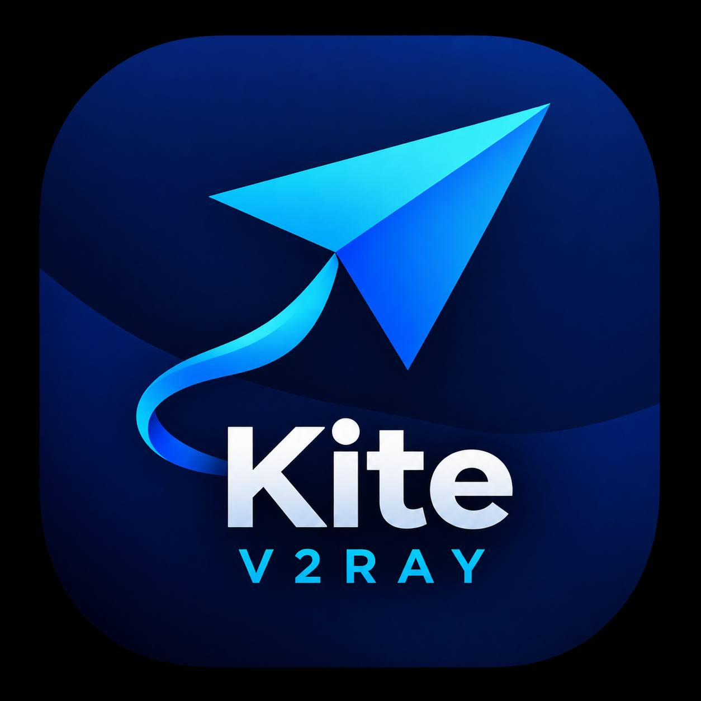
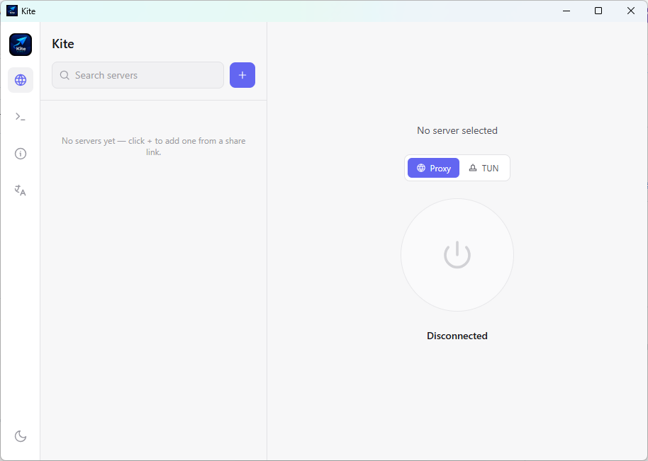
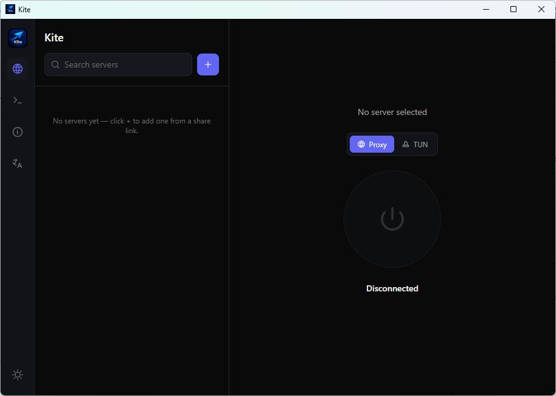

<div align="center">
  

  # Krab

  **A cross-platform desktop V2Ray/proxy client.**
  Wails + Go backend, React/Tailwind frontend, xray-core embedded as a Go library.

  [](https://github.com/krabt/krab/releases/latest)
  [](https://github.com/krabt/krab/actions/workflows/release.yml)
  [](#downloads)
  [](https://goreportcard.com/report/github.com/krabt/krab)
  [](LICENSE)

  [Download](#downloads) · [Features](#features) · [Building from source](#building-from-source) · [Architecture](#architecture)

  English · [中文](README.zh.md) · [فارسی](README.fa.md) · [Türkçe](README.tr.md) · [العربية](README.ar.md) · [Français](README.fr.md) · [Deutsch](README.de.md) · [Русский](README.ru.md)
</div>

<p align="center">
  
  
</p>

---

## Downloads

Grab the latest build from the **[Releases page](https://github.com/krabt/krab/releases/latest)**:

| Platform | Download |
| --- | --- |
| Windows (x64) | `krab-windows-amd64.exe` |
| Linux (x64) | `krab-linux-amd64` |
| macOS (Apple Silicon) | `krab-macos-arm64` |

Every platform ships as a single portable executable — no installer, no admin rights
required (the macOS build is the raw binary pulled out of the `.app` bundle Wails produces;
see [Known gaps](#known-gaps--next-steps) for the Gatekeeper prompt this means, and how to
get past it). Once installed, it checks for new releases on startup and can update itself
in one click.

## Features

- **Link formats**: `vmess://`, `vless://`, `trojan://`, `ss://`, `hysteria2://`, `ssh://` — paste a share link and it's parsed and saved
- **Subscription URLs** — paste an `http(s)://` subscription link (the base64 link-list format used by V2RayN/V2RayNG/Shadowrocket) and every server it contains is imported at once, folded into one collapsible group in the list (subscriptions can carry hundreds of servers). The group shows plan/traffic/expiry info when the provider reports it (via the `Subscription-Userinfo` header, or the fake "info" entries some providers mix into the link list), and has its own buttons to sync, share (copy the subscription URL, or every server as a plain link list), edit (rename / change URL), and remove it. Besides the usual base64 link list, Clash/Mihomo YAML, sing-box JSON, Xray JSON and Shadowsocks SIP008 subscriptions are understood too, and subscriptions auto-sync on launch when the provider's `Profile-Update-Interval` has passed
- **Share any server** — copies its standard `vless://` / `vmess://` / `trojan://` / `ss://`, `hysteria2://`, `ssh://` link for use in another client
- **xray-core**, embedded as a Go library (not a shelled-out binary) — full lifecycle control and real traffic stats, no parsing stdout
- **Transports**: TCP (including xray-core's `headerType=http` disguise), WebSocket, and gRPC, with TLS/REALITY security detection straight from the link
- **System proxy integration** — Connect/Disconnect toggles the OS HTTP proxy automatically (per-user registry on Windows, no elevation needed)
- **TUN mode (Windows)** — routes all system traffic through a virtual network adapter (xray-core's TUN with the bundled WinTun driver), instead of just apps that honor a proxy setting. Works with every server type, including `headerType=http`. DNS goes through the tunnel too. Needs administrator privileges; Krab can relaunch itself elevated with one click
- **Kill switch (Windows)** — blocks all outbound traffic except Krab's own while connected, by switching Windows Firewall's default outbound policy to block, so an app that ignores the system proxy (or a crashed xray process) can't leak traffic outside the tunnel. Same admin requirement as TUN mode
- **System tray** — closing the window hides it to the tray instead of quitting, so an active connection keeps running; the tray menu has Show Krab, Disconnect, and Quit Krab
- **Built-in diagnostics** — a Test button makes a real request through the tunnel and reports the actual result; a log viewer surfaces xray-core's own debug log inline
- **Self-updating** — checks GitHub Releases on launch, one click downloads, swaps, and relaunches (About panel shows both Krab's and the embedded xray-core's version)
- **Dark / light themes**, with a searchable server list, inline rename, and one-click remove
- **8 languages**, switchable from the sidebar (Persian uses the bundled Vazirmatn font):
  - 🇬🇧 English (default)
  - 🇨🇳 中文 (Chinese)
  - 🇮🇷 فارسی (Persian)
  - 🇹🇷 Türkçe (Turkish)
  - 🇸🇦 العربية (Arabic)
  - 🇫🇷 Français (French)
  - 🇩🇪 Deutsch (German)
  - 🇷🇺 Русский (Russian)

## Building from source

### One-time toolchain setup

1. **Go 1.27+** — https://go.dev/dl/. Windows also needs a C compiler for CGO
   (Wails and some of its dependencies use it) — install
   [TDM-GCC](https://jmeubank.github.io/tdm-gcc/) or `winget install -e --id GoLang.Go`
   plus MSYS2's `mingw-w64-x86_64-gcc`.
2. **Node.js (LTS)** — https://nodejs.org, or `winget install OpenJS.NodeJS.LTS`.
3. **Wails CLI**:
   ```bash
   go install github.com/wailsapp/wails/v3/cmd/wails3@latest
   wails3 doctor   # confirms platform dependencies (WebView2 etc.) are present
   ```

### Run it

```bash
go mod tidy                     # resolves dependencies into go.sum
corepack enable
cd frontend && pnpm install && cd ..
wails3 dev                      # generates frontend/bindings/* and starts hot reload
```

### Build a release binary

```bash
wails3 build
```

## Architecture

```
krab/
├── main.go / app.go        Wails entrypoint + the App struct (Go methods
│                            exposed to the frontend via the JS bridge)
├── internal/
│   ├── xray/                 xray-core lifecycle
│   │   ├── manager.go         Start/Stop a core.Instance (proxy or TUN mode),
│   │   │                      traffic counters from xray's stats.Manager
│   │   ├── config.go          Server profile -> xray-core JSON config
│   │   └── tun_windows.go     Writes the embedded wintun.dll next to the
│   │                          exe (TUN mode needs it alongside the binary)
│   ├── profile/              vmess/vless/trojan/ss link parsing +
│   │                         JSON-file server storage
│   ├── system/                per-OS HTTP/SOCKS system proxy toggling +
│   │   │                      TUN-mode support (Windows)
│   │   ├── proxy_windows.go   HKCU Internet Settings (no admin needed)
│   │   ├── proxy_darwin.go    networksetup
│   │   ├── proxy_linux.go     gsettings (GNOME)
│   │   ├── elevate_windows.go Check/request administrator privileges
│   │   ├── route_windows.go   Exception route so xray's own upstream
│   │   │                      connection doesn't loop through the TUN
│   │   │                      adapter it's feeding (see that file's docs)
│   │   └── wintun/            Embedded Wintun driver DLL (dual GPLv2/MIT,
│   │                          see WINTUN_LICENSE.txt in that directory)
│   └── update/                self-update: check GitHub Releases, download
│                               + swap the running executable, relaunch
├── frontend/                 Vite + React + Tailwind (CSS-variable theming
│                              for dark/light), talks to app.go via Wails
└── .github/workflows/         CI: builds + publishes GitHub Releases on
    release.yml                 any pushed `v*` tag
```

Every bound Go method on `App` (in [app.go](app.go)) becomes a callable JS function in
the frontend once `wails3 generate bindings` creates `frontend/bindings/github.com/krabt/krab/app.js`.

## Known gaps / next steps

- **macOS is Apple Silicon (arm64) only** — no Intel build. If that's needed, add a
  `darwin/amd64` matrix entry in `.github/workflows/release.yml` alongside the
  `darwin/arm64` one.
- **TUN mode is Windows-only** and IPv4-only for now — the exception route that keeps
  the engine's own upstream connection from looping through the TUN adapter
  (`internal/system/route_windows.go`) only covers resolved IPv4 addresses; a server
  that's only reachable over IPv6 won't work in TUN mode yet. Linux/macOS TUN support is
  possible (xray-core's TUN supports both) but the routing setup isn't wired up here.
- **Linux system proxy only covers GNOME** (`gsettings`) — other desktop environments
  need their own backend in `internal/system/proxy_linux.go`.
- **Kill switch is Windows-only** — implemented via `netsh advfirewall` rules
  (`internal/system/killswitch_windows.go`); Linux/macOS need their own backend
  (`iptables`/`pfctl`) and are unimplemented for now (the toggle is hidden there,
  same as TUN mode).
- **The native minimize button still just minimizes to the taskbar** — Wails v2 doesn't
  expose a hook for the OS-level minimize event, only window close (`OnBeforeClose`,
  which the tray feature uses). Only closing the window hides it to the tray.
- **No automated tests yet.**
- **No code-signing** — Windows SmartScreen and macOS Gatekeeper will both warn on an
  unsigned binary; this is expected for now. On macOS, running the downloaded binary the
  first time needs `xattr -d com.apple.quarantine krab-macos-arm64` (or right-click →
  Open) to get past Gatekeeper, since it isn't notarized. On Windows, antivirus software
  (including Defender) sometimes quarantines `wintun.dll` right after Krab writes it next
  to itself for TUN mode, since a kernel-adjacent networking DLL like this gets flagged
  heuristically — the same thing WireGuard, v2rayN, and other Wintun-based apps run into.
  If TUN mode fails with a file-not-found-style error, add Krab's folder to your
  antivirus's exclusions.

## Contributing

Issues and PRs welcome. See [Known gaps](#known-gaps--next-steps) above for what's
actually left to do.

## License

[MIT](LICENSE)
