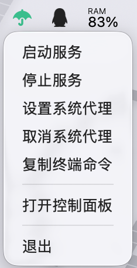
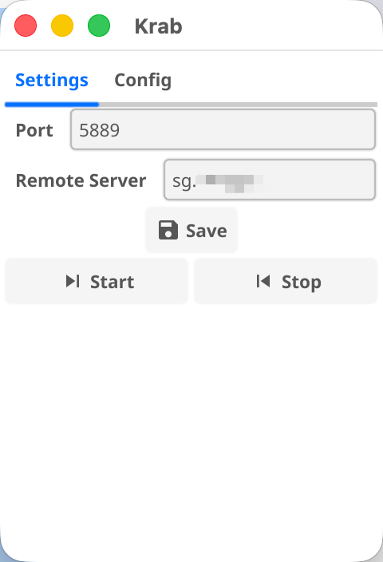
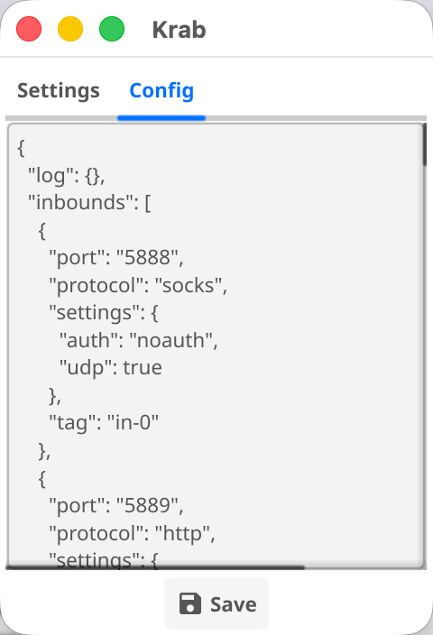

## Krab

mac xray 客户端，支持配置文件方式管理


### 实现原理

基于命令方式启动xray，管理进程使用[keeper](https://github.com/linker-bot/linker-keeper)，ui 框架基于fyne。

Krab 运行后会读取家目录下的文件` ~/.krab`，当启动服务的时候会执行`~/.krab/xray -c config.json`，理论上也可以兼容v2ray，入站`tag`为`http-in`，用于支持修改系统代理端口。

截图：







### 功能支持

* 启动和停止xray服务
* mac 设置和取消全局代理

编译

```shell
[sc@kk .krab]🐳 fyne package -os darwin release
```


### 目录文件

```shell
[sc@kk .krab]🐳 tree .
.
├── config.json
├── geoip.dat
├── geosite.dat
└── xray
1 directory, 4 files
```


### 配置文件模版

```
{
  "log": {},
  "inbounds": [
    {
      "port": "5888",
      "protocol": "socks",
      "settings": {
        "auth": "noauth",
        "udp": true
      },
      "tag": "in-0"
    },
    {
      "port": "5889",
      "protocol": "http",
      "tag": "http-in"
    }
  ],
  "outbounds": [
    {
      "tag": "proxy",
      "protocol": "vless",
      "settings": {
        "vnext": [
          {
            "address": "remote-ip",
            "port": 443,
            "users": [
              {
                "id": "821EAF4C-9F14-4857-8901-EA7E67B7BC58",
                "encryption": "none"
              }
            ]
          }
        ]
      },
      "streamSettings": {
        "network": "xhttp",
        "xhttpSettings": {
          "path": "kVJPcKW3kHTmuuqxLgAN",
          "mode": "auto"
        },
        "security": "tls",
        "tlsSettings": {
          "allowInsecure": true,
          "verifyClientCertificate": false
        }
      }
    },
    {
      "tag": "direct",
      "protocol": "freedom",
    },
    {
      "tag": "blocked",
      "protocol": "blackhole",
    }
  ],
  "routing": {
    "domainStrategy": "IPOnDemand",
    "rules": [
      {
        "type": "field",
        "outboundTag": "blocked",
        "domain": [
          "geosite:sogou",
          "geosite:wps",
          "domain:dc.services.visualstudio.com",
          "domain:jianshu.com",
          "geosite:category-ads"
        ]
      },
      {
        "type": "field",
        "outboundTag": "proxy",
        "domain": [
          "geosite:github",
          "geosite:docker",
          "geosite:openai",
          "domain:googlecccccccccc.com",
          "domain:go.dev"
        ]
      },
      {
        "type": "field",
        "outboundTag": "direct",
        "domain": [
          "domain:gorm.io",
          "domain:jetbrains.com.cn",
          "domain:jetbrains.com",
          "domain:kubernetes.docker.internal",
          "geosite:cn",
          "geosite:google-trust-services",
          "geosite:digicert",
          "geosite:letsencrypt",
          "geosite:mozilla",
          "geosite:apple",
          "geosite:private"
        ]
      },
      {
        "type": "field",
        "outboundTag": "direct",
        "ip": [
          "geoip:cn",
          "geoip:private",
          "223.5.5.5",
          "223.6.6.6",
          "127.0.0.1",
          "114.114.114.114",
          "192.168.31.0/24",
          "192.168.8.0/24",
          "10.1.0.0/8"
        ]
      }
    ]
  }
}
```

